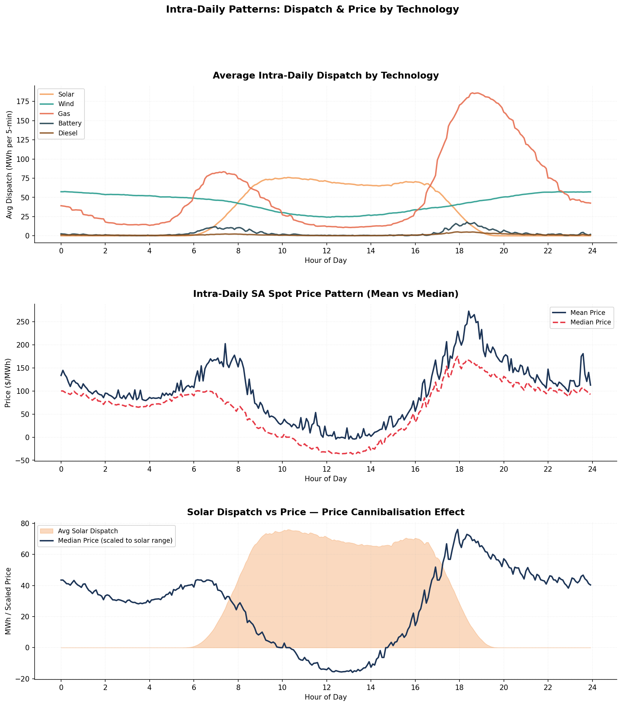
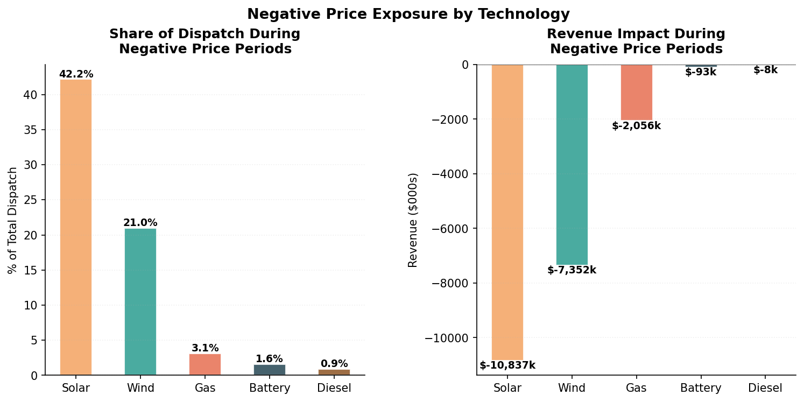
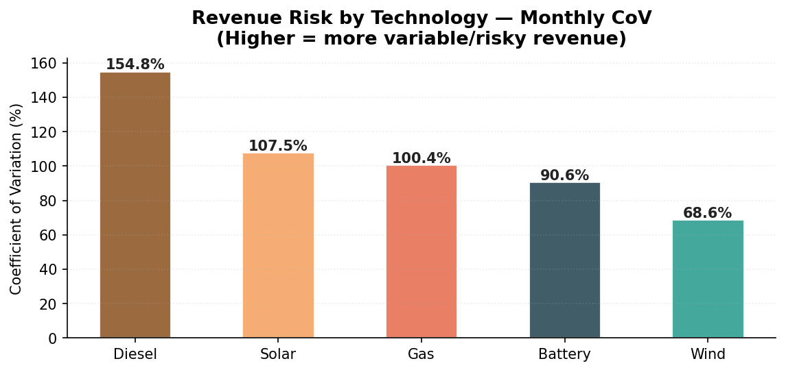
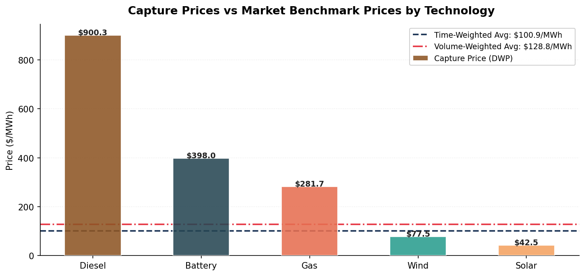

#  South Australian Electricity Market Analysis

**Which renewable technology is the strongest investment in South Australia's wholesale electricity market?**

Python analysis of **210,526 five-minute AEMO NEM dispatch intervals** (Jul 2022 – Jun 2024) comparing **15 generators across 5 technologies** on capture price, revenue, revenue risk and capacity factor.

> **Bottom line:** Wind is the strongest renewable investment: the highest renewable capture price, the most stable revenue (lowest CoV, 68.57%) and a capacity factor within AEMO benchmarks. Solar is structurally penalised by price cannibalisation, losing **$10.84M** during negative-price periods.

## Key Findings

|  | Finding | Evidence |
|---|---|---|
| 1 | **Solar cannibalises its own price** | 42.16% of solar dispatch occurred at negative prices, costing **$10.84M** in revenue |
| 2 | **Wind has the most predictable revenue** | Lowest monthly revenue CoV (**68.57%**) vs solar 107.51% and diesel 154.77% |
| 3 | **Wind earns the best renewable price** | Capture price **$77.53/MWh** vs solar **$42.48/MWh** |
| 4 | **Battery profits from timing** | **$397.95/MWh** capture price through peak-price arbitrage |
| 5 | **Gas faces decline risk** | Highest revenue, but down **40%** from FY23 ($178.9M) to FY24 ($107.9M) |

---

## 📊 Visual Highlights

### 1. Solar price cannibalisation
Midday prices collapse below $0 exactly when solar output peaks, so solar sells most of its energy at the lowest prices of the day.

### 2. Negative price exposure
Solar has the largest share of dispatch (42.2%) and revenue loss (-$10.84M) during negative-price periods.

### 3. Revenue risk by technology
Wind has the lowest monthly revenue variability, which means the most predictable, financeable cash flows.

### 4. Capture price vs market benchmarks
Dispatchable technologies (diesel, battery, gas) earn above market average; wind earns close to it; solar falls furthest below.

## Recommendations
- **Prioritise wind** as the core renewable investment for stable, predictable returns
- **Pair solar with battery storage** to shift output away from low or negative midday prices
- **Treat gas and diesel cautiously** given falling wholesale prices and long-term stranded-asset risk

## Methodology
- **Data cleaning:** reduced 315,632 raw rows to 210,526 valid intervals by removing blank and duplicate rows and rows without timestamps; filled missing dispatch with 0 (no dispatch = no output)
- **Capture price (DWP):** `Σ(Price × Dispatch) / Σ(Dispatch)`, benchmarked against time-weighted ($100.88/MWh) and volume-weighted ($128.79/MWh) market averages
- **Revenue:** `Price × Dispatch (MW) × 5/60`. Converts each 5-minute MW reading to MWh
- **Revenue risk:** monthly coefficient of variation (CoV = std / mean)
- **Capacity factor:** benchmarked against AEMO industry ranges (wind: 27.38%, within the 25–40% benchmark)
- **Intra-daily and negative-price analysis** by technology

## Tools
Python · pandas · NumPy · Matplotlib · Seaborn · SciPy · Jupyter Notebook

## Data
AEMO National Electricity Market (NEM) 5-minute dispatch and price data for South Australia (SA1), FY2022/23 – FY2023/24. Installed capacity from AEMO Generation Information and OpenElectricity. 

*Academic project, Master of Business Analytics (BUSA8031 Business Analytics Project), Macquarie University, 2026.*
